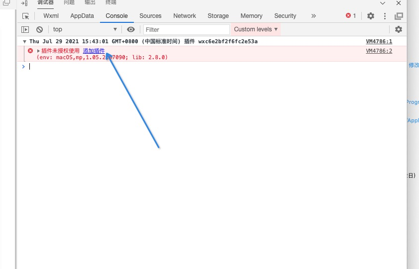
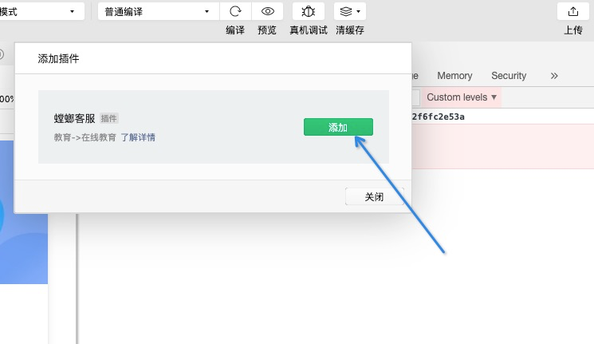
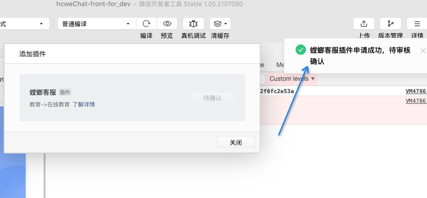

# 螳螂客服SDK(使用步骤说明)

### 引入插件代码包

> 使用插件前，使用者要在 app.json 中声明需要使用的插件，例如：

```json

{
    "plugins": {
        "mantisChat": {
            "version": "1.0.10",
            "provider": "wxc6e2bf2f6fc2e53a"
        }
    }
}

```

> 需要使用的螳螂客服的页面埋码，例如：

- json文件配置

```json

{
    "usingComponents": {
        "mantisChat": "plugin://mantisChat/mantisChat"
    }
}
```

- js文件

```javascript
onReady() {
    this.mantisChat = this.selectComponent('#mantisChat');
}
// 发起会话时调用 
mantisRequestChat() {
    this.mantisChat._requestChat();
}
// 留言表单提交时调用
handleSubmit() {
    /* 
        formValue 留言表单的数据对象  
            phone  必填
            area,qq,weChat会显示在留言查询数据对应字段的位置
            
        formValue : {
            phone: 16656789088,
            name: '张三',
            content:'备注内容',
            others: {
                area:'地域值',
                qq:'QQ',
                weChat:'微信',
                customerFieldMap:{  // 自定义字段,此对象中的字段如果和系统中自定义字段对应上就会显示在转客后对应字段的位置，如果对应不上会显示在转客后的备注里
                    "年龄":'24',
                    "兴趣":'运动'
                }
            }
        }
   * */
    let formValue = {
        phone: 13123123123
    };
    this.mantisChat._sendPage(formValue);
}

```

- wxml文件

```html
<!--
    发起会话调用方法 bindtap="mantisRequestChat"
-->
<button bindtap="mantisRequestChat">发起会话</button>

<!--
    companyId: 客户的公司id（必填）
    probeId: 探头id（必填）
    chatPageUrl  小程序推广链接或探头"直达聊窗链接"（必填）
    serverUrl: 探头请求域名（不必填）
    uid: 可以传openId或UnionId 等唯一标识 
    phone：通过授权获取的访客手机号 
    params: {object} 其他参数
    
        object 对象有如下参数:
        
        miniProgramParams 小程序携带参数，如：sku=1077777&platform=1&gdt_vid=wx0ewinbalytptma00&weixinadinfo=20966864.wx0ewinbalytptma00.0.1
        account
        userId
        pageParam 页面埋码参数
-->
<mantisChat
        id="mantisChat"
        companyId="3403"
        probeId="60ff7b7942e6824c77cf5c70"
        chatPageUrl="https://demo2.bjmantis.net/chat/t1/chat.html?mcid=3403&mpid=60f6335542e6827c32c4d8bb"
/>
```

+ 上述操作完成后打开开发者工具控制台







+ 联系运营等待审核通过


[comment]: <> (这个文件用于书写插件文档，引用图片时必须以**相对路径**引用 ***doc*** 目录下的本地图片，不能使用网络图片或非 ***doc*** 目录下的图片。以下是相对路径的引用示例：)

[comment]: <> (![链接]&#40;./example.jpeg&#41;)

[comment]: <> (使用编辑器下方的上传按钮可以上传插件文档，上传的内容包括 doc 目录下的 README.md 和图片。)


